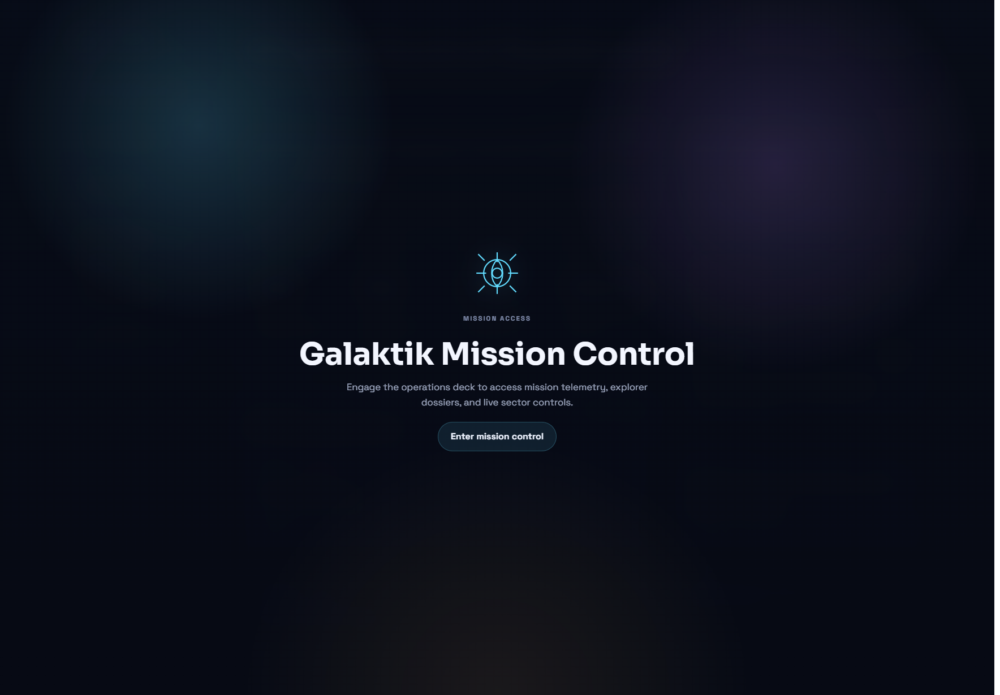
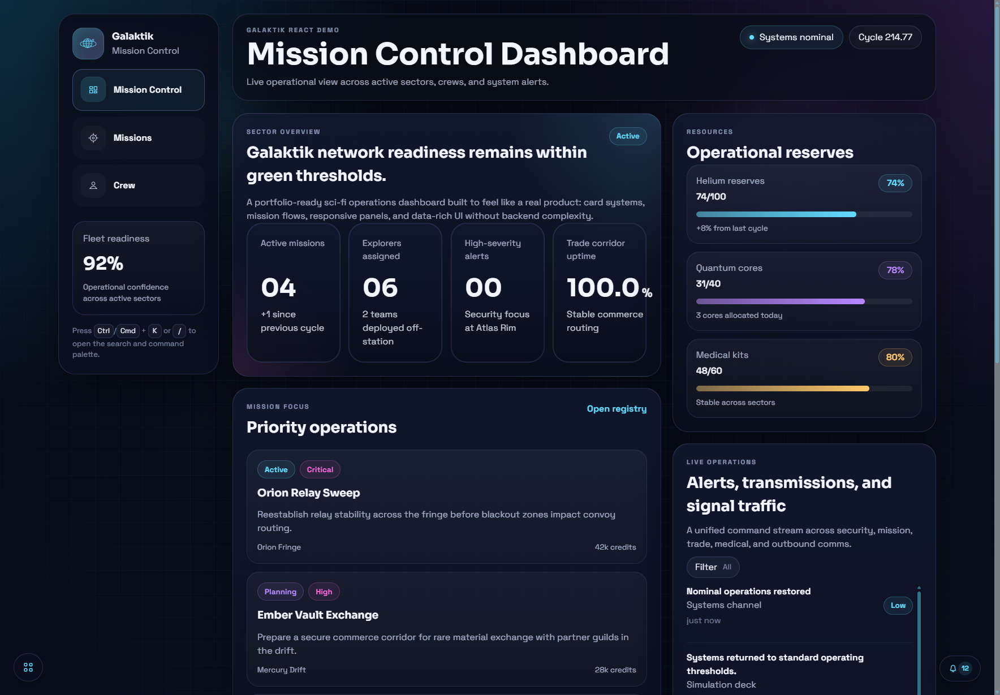
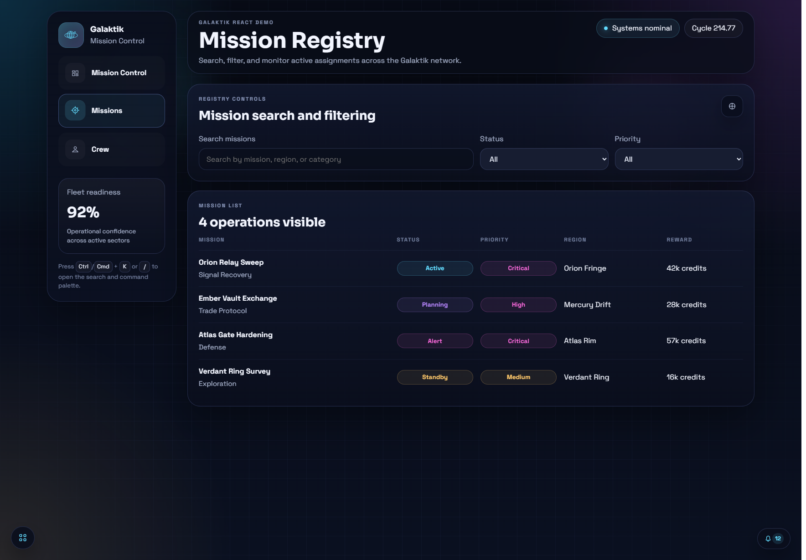
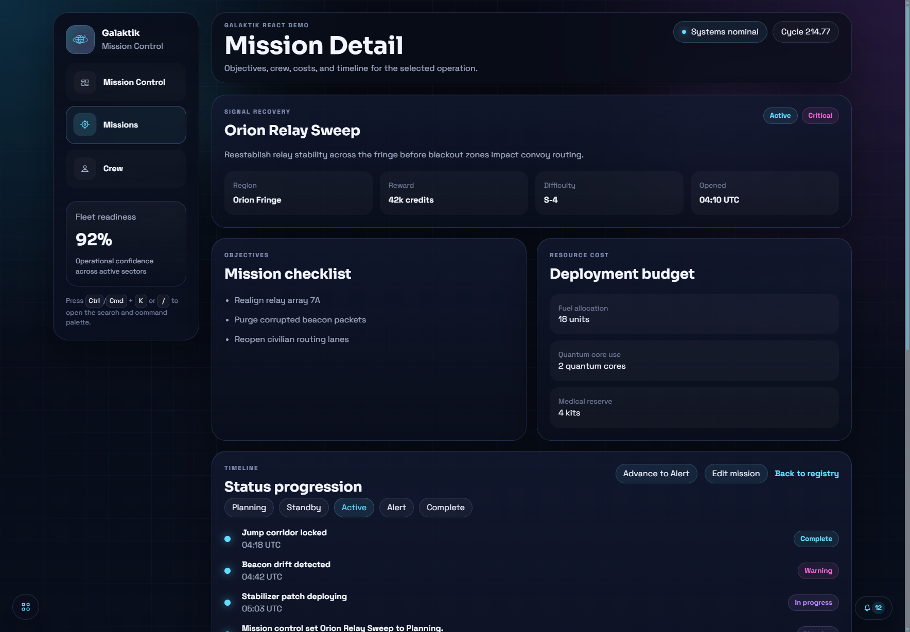
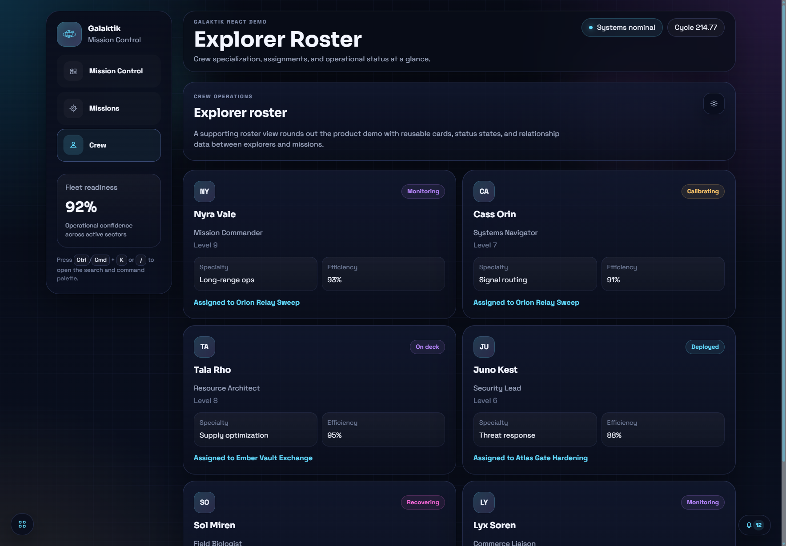
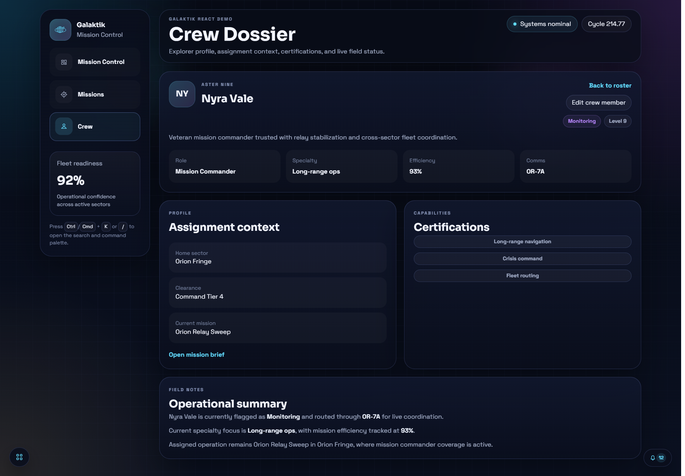
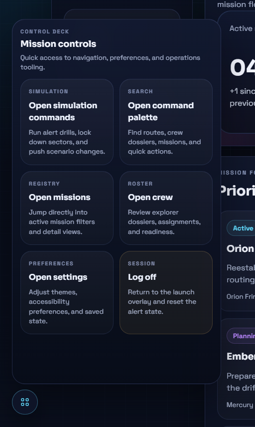
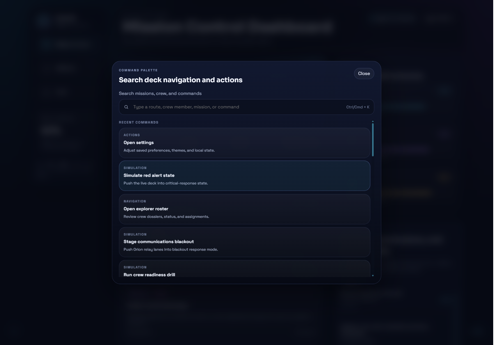
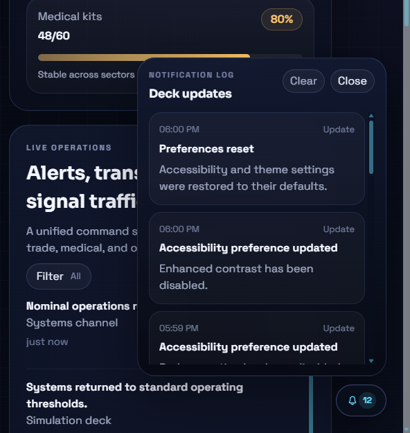

# Galaktik Mission Control

Galaktik Mission Control is a React portfolio demo built as a polished sci-fi operations dashboard. The project is designed to feel like a believable product UI rather than a static landing page, with routed views, reusable interface primitives, persistent local state, command-driven interactions, and animated transitions throughout the experience.

The app presents a fictional "mission control" environment for monitoring missions, explorer assignments, resource reserves, live operational traffic, and simulated alert-state changes across the Galaktik universe.

## Screenshot gallery

These screenshots highlight the main interaction surfaces and routed product flows in the demo.

### Mission access overlay

The launch overlay frames the experience before the user enters the dashboard, reinforcing the brand and treating the app like a real product surface instead of a default landing page.



### Mission control dashboard

The dashboard combines the sector overview, reserve tracking, mission focus, crew preview, and unified live operations feed into a single command surface.



### Mission registry

The registry view shows the searchable mission list, filter controls, reusable status styling, and the list/detail structure of the mission workflow.



### Mission detail

Each mission dossier exposes objectives, resource budget, timeline progression, and direct status controls for a more application-like experience.



### Explorer roster

The roster page extends the product beyond dashboards into a more operational personnel view with reusable crew cards and linked mission assignments.



### Crew dossier

Crew detail pages connect explorer identity, assignment context, certification data, and edit actions into a dedicated profile view.



### Control deck

The floating control deck acts as a compact action hub for navigation, settings, simulations, and session-level controls.



### Command palette

The keyboard-first command palette supports quick routing and action dispatch across missions, crew, settings, and simulation commands.



### Notification log

The notification log complements transient toasts with a persistent, scrollable operational history panel.



## Project goals

This project was built to demonstrate:

- Strong React component composition
- Reusable UI architecture
- Cleanly organized mock data
- Practical client-side state management
- Responsive dashboard layout skills
- Interaction design beyond static cards and sections
- Accessibility-aware modal, keyboard, and motion handling
- The ability to translate a branded visual concept into a usable product interface

## Stack

- React 18
- Vite 5
- React Router DOM 6
- GSAP for UI animation
- Plain CSS with a custom theming system based on CSS variables
- LocalStorage for lightweight persistence

## Core experience

The application is built around a mission control shell with a branded launch overlay, a persistent left navigation rail, routed content pages, and system overlays for search, settings, notifications, and control actions.

### Main routes

- `/`
  Mission Control dashboard with sector overview, mission spotlight cards, assigned crew, resource meters, and a unified live operations feed.
- `/missions`
  Mission registry with search and filtering controls plus mission creation.
- `/missions/:missionId`
  Mission detail dossier with mission timeline, objectives, status controls, resource budget, assigned crew, and mission editing.
- `/crew`
  Explorer roster with roster management controls and crew creation/hide/reset actions.
- `/crew/:memberId`
  Explorer dossier page with operational summary, profile metadata, certifications, mission linkage, and direct editing.

## Feature overview

### 1. Launch overlay

On initial load, the app opens on a branded mission-access overlay instead of dropping directly into the dashboard. Entering the application animates the overlay upward to reveal the shell beneath it.

This layer also:

- Locks background scrolling while visible
- Starts keyboard focus on the primary action
- Supports keyboard interaction
- Allows a "log off" flow to return to the initial launch state

### 2. Dashboard

The dashboard is the product-style overview page and includes:

- Sector overview hero
- Stat cards for readiness/critical metrics
- Priority mission spotlight cards
- Assigned explorer preview cards
- Resource reserve meters
- Unified live operations feed with filter controls

The overview can switch between nominal and alert-state presentations, changing copy, values, tone, and status emphasis.

### 3. Mission registry and mission detail flows

The mission layer is split into list and detail views:

- Mission registry search/filter page
- Click-through mission detail pages
- Create mission modal
- Edit mission modal
- Mission status controls
- Mission timeline updates
- Assigned crew display per mission

This gives the project a real list/detail workflow instead of a single-page dashboard only.

### 4. Crew roster and crew dossier flows

The crew side of the app includes:

- Explorer roster grid
- Dynamic crew dossier pages
- Create crew modal
- Edit crew flow on individual crew pages
- Hide/restore controls in the dataset manager
- Dataset reset action

Crew pages connect back to missions, and mission pages connect back to crew, which makes the demo feel more like a real product graph than isolated screens.

### 5. Control deck

The bottom-left control deck is a floating interaction hub that expands into a compact panel system.

It contains:

- Quick navigation shortcuts
- Search/command palette entry
- Settings access
- Log off action
- Simulation commands page

The simulation panel transitions horizontally inside the same deck container and includes scenario commands such as:

- Toggle red alert
- Sector lockdown
- Crew readiness drill
- Telemetry sweep
- Communications blackout
- Restore nominal systems

### 6. Search and command palette

The search palette acts as a lightweight command center for the app. It supports:

- Keyboard shortcut access via `Ctrl/Cmd + K`
- Secondary shortcut via `/`
- Auto-focus on the search input when opened
- Recent command recall
- Search across routes, missions, crew, and actions
- Quick navigation from command results
- Simulation command dispatch

This is one of the primary portfolio features because it shows interface design beyond standard page navigation.

### 7. Notifications and toast system

The app includes two notification layers:

- Toast notifications for immediate feedback
- A persistent notification log for history

Current behavior includes:

- Animated toast entry and dismissal
- Visible toast limit with overflow tracking
- Scrollable notification history panel
- Clear action for the notification log
- Hover-reveal label behavior on the updates button
- Notification feed persistence in local storage

### 8. Theming and alert modes

The visual system supports both nominal and red-alert states, plus theme variants stored in user preferences.

The app includes:

- Nominal mode palettes
- Alert mode palettes
- Theme switching stored in local state
- Accessibility preferences stored in local state
- Higher-contrast styling options
- Reduced-motion support

### 9. Persistence

This demo intentionally behaves more like a small product than a static mockup.

The following state is persisted via LocalStorage:

- Whether the launch overlay has already been revealed
- Theme selections
- Accessibility preferences
- Recent command history
- Notification history
- Scenario data mutations for the active dataset model

This gives the app continuity across refreshes without adding backend complexity.

## Accessibility considerations

The project includes several accessibility-focused behaviors:

- Skip link to main content
- Keyboard access for overlay and search interactions
- Dialog semantics for overlay/palette/modals
- `aria-live` usage for loading and toast updates
- Reduced motion support
- Focus restoration for the launch overlay flow
- Clear labels on navigation and control actions

The app is not positioned as a fully audited WCAG-complete production system, but accessibility has been treated as a first-class concern rather than an afterthought.

## Animation approach

GSAP is used to add motion to the interface in a way that supports the product feel of the demo.

Animated interactions include:

- Mission-access overlay reveal
- Route content transitions
- Control deck opening and sub-panel movement
- Search palette entrance/exit
- Notification log entrance/exit
- Toast entry and dismissal
- Staggered UI reveals for page sections

Motion is intentionally used to clarify state changes and add polish, not just for decorative effect.

## Data model

The app runs on structured mock data rather than API calls. Data is separated into focused modules under `src/data/galaktik`.

Primary content types include:

- Missions
- Crew
- Alerts
- Transmissions
- Metrics
- Resources
- Scenario presets

This keeps the data layer easier to evolve and avoids one monolithic data file.

## Project structure

```text
src/
  components/
    ActivityFeed.jsx
    AppShell.jsx
    CrewCard.jsx
    CrewEditModal.jsx
    CrewManagerModal.jsx
    MissionEditModal.jsx
    MissionManagerModal.jsx
    NotificationFeed.jsx
    ResourceMeter.jsx
    SearchPalette.jsx
    SettingsModal.jsx
    SidebarNav.jsx
    StatCard.jsx
    StatusBadge.jsx
    ToastStack.jsx
    TopHeader.jsx
  context/
    AlertModeContext.jsx
  data/
    galaktik/
      activity.js
      crew.js
      metrics.js
      missions.js
      resources.js
      scenarioData.js
    galaktikData.js
  lib/
    localState.js
  pages/
    DashboardPage.jsx
    MissionsPage.jsx
    MissionDetailPage.jsx
    CrewPage.jsx
    CrewDetailPage.jsx
  theme/
```

## Architectural notes

### App shell

`AppShell.jsx` is the main frame for the entire experience. It owns:

- Launch overlay state
- Route-stage animation
- Control deck behavior
- Search/settings/notification overlays
- Theme application via CSS variables

### Shared state

`AlertModeContext.jsx` acts as the central interaction/state layer. It manages:

- Red alert state
- Scenario data
- Preference state
- Recent commands
- Notification feed
- Toasts
- Mission updates
- Crew updates
- Simulation commands

### Presentational components

Most visual sections are intentionally split into smaller reusable pieces, such as:

- `StatusBadge`
- `StatCard`
- `ResourceMeter`
- `CrewCard`
- `ActivityFeed`
- `MissionTable`

This keeps page files focused on layout and composition instead of low-level rendering details.

## Running the project

### Prerequisites

- Node.js 18+ recommended
- npm

### Install

```bash
npm install
```

### Start the dev server

```bash
npm run dev
```

### Build for production

```bash
npm run build
```

### Preview the production build

```bash
npm run preview
```

## Available scripts

- `npm run dev`
  Starts the Vite development server.
- `npm run build`
  Builds the project for production.
- `npm run preview`
  Serves the production build locally for preview.

## Design direction

The visual language aims for:

- Dark space-inspired UI
- High readability despite the sci-fi theme
- Neon and atmospheric accent color usage
- Layered panels with depth
- Strong hierarchy and dense but legible information layouts

The project intentionally avoids becoming pure "lore UI." The goal is to balance style with usability so the result still reads like a serious frontend product demo.

## What this project is not

This demo is intentionally scoped as a frontend portfolio piece. It does not include:

- A backend or API
- Authentication
- Real-time sockets
- Database persistence
- Server-side rendering
- Test coverage at this stage

Those omissions are deliberate so the project can stay focused on interface architecture, interaction design, and polish.

## Suggested portfolio description

> A React-based sci-fi operations dashboard built for the Galaktik universe, focused on reusable UI architecture, responsive design, persistent local state, and polished data-driven interactions.

## Why it works as a portfolio piece

This project is useful in a portfolio because it demonstrates more than visual styling. It shows:

- Routed multi-page flows
- A reusable component system
- UI state orchestration
- Local persistence
- Search and command workflows
- Modal management
- Context-driven updates
- Interactive dashboard patterns
- Product-minded design decisions

It reads like an application, not just a themed mockup.

## Future extension ideas

If this demo were expanded further, strong next steps would include:

- Automated tests for core flows
- Better focus trapping for every modal and popover
- Analytics-style charts for operations trends
- Mission assignment editing between crew and mission pages
- Richer simulation scenarios
- Exportable reports or printable mission briefs
- Backend-backed persistence
- Role-based views for different operators

## Current status

The app is production-buildable and already supports a substantial interactive feature set for a portfolio demo, including:

- Routed pages
- Dynamic detail views
- Create/edit modal workflows
- Notification systems
- Keyboard command palette
- Simulation state controls
- Theming and accessibility preferences
- Persistent local state

## License

No license has been defined in this repository yet. Add one if you intend to publish or distribute the project publicly.
